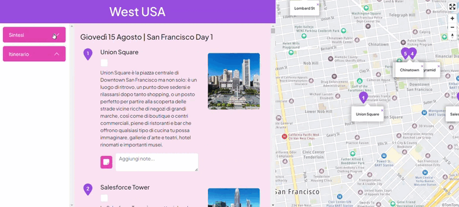

# Travel App

Travel App is a web app for planning and managing a summer trip in the West USA.

## Installation

In order to see and use the web app, just go to the following link: https://raccoonstravel.netlify.app/

In order to access the code, go to my GitHub at the following link: https://github.com/BeatriceRocchi/travel-app.
Now clone the repository, open it in your IDE and install all the dependencies and run by running the development server:

```bash
npm install
npm run dev
```

## Description



In desktop view the web app is made up of three main components:

1. **Menu**

   The quick menu on the left has two sections accessible by clicking on the accordion item. In details, by clicking on the _'itinerary'_ accordion item, you can access the list of travel days and their title. By clicking on a day, the main section on the right with the detailed stops for each day automatically scrolls to the day clicked.

2. **Main section**

   The main section contains the details of the trip day by day. For each day the stops to visit are shown. For each stop the following information are reported:

   - stop number
   - title
   - brief description
   - image
   - textarea to add notes.

   In addition, under the title of each stop there is a checkbox to tick when the stop has been visited. When the checkbox is ticked, the possibility of entering a rating (from 0 to 5 stars) appears on the right.

   Thanks to a functionality implemented through the LocalStorage, the progression of visited/unvisited stops, notes and ratings added are maintained even after the web page is closed.

3. **Map**

   This section on the right shows the stops of the trip on a map through the integration of TomTom Map. Upon loading, the map is focused on the last stop visited or, if no stops have been visited yet, on the first stop of the trip.

The web app is also responsive and the layout changes according to the device width to ensure a good user experience. For example, in phone and tablet visualization, the menu is on top of the page and the map is shown through a modal only when the map button on the bottom right of the viewport is clicked.


